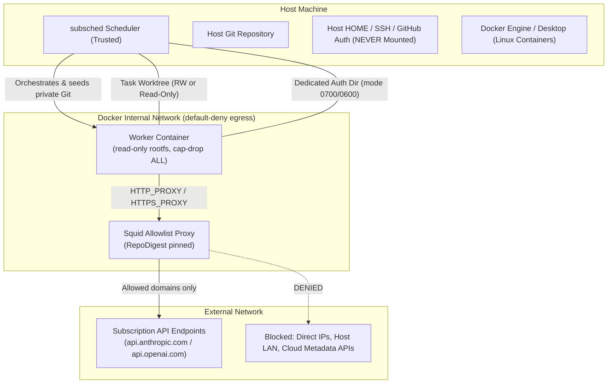
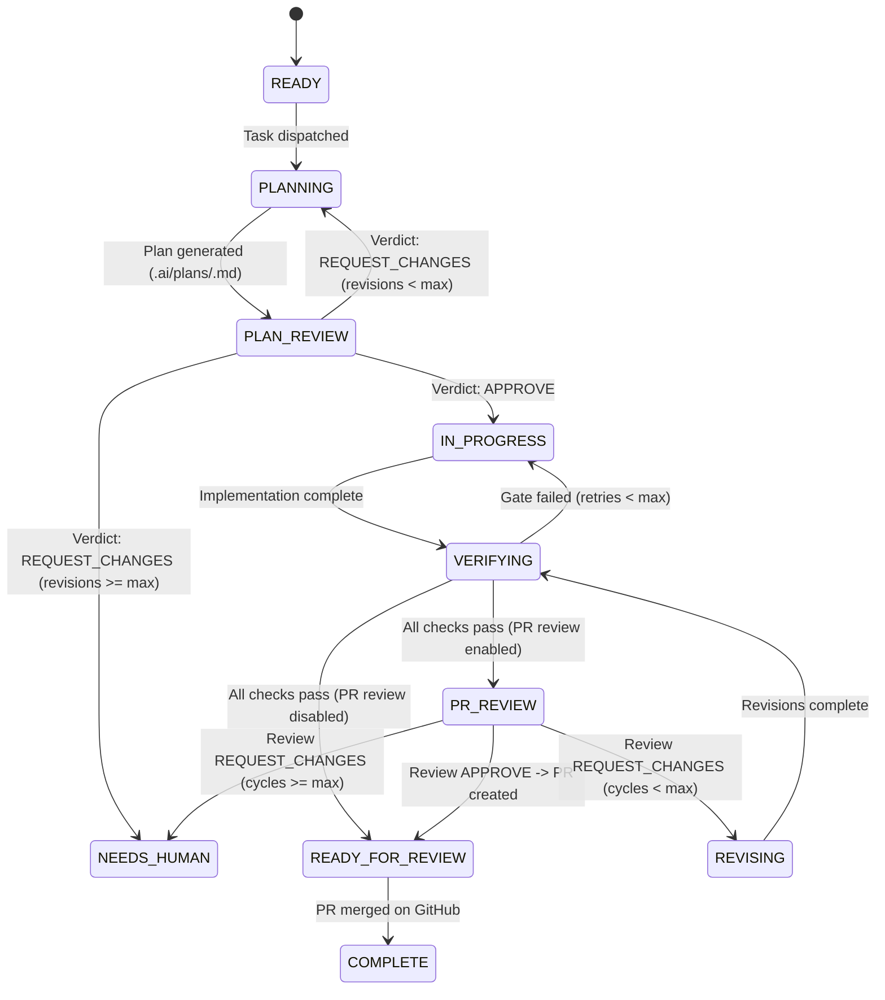

# Subscription Agent Scheduler (`subsched`)

`subsched` is a deterministic, subscription-aware coding agent scheduler that turns GitHub Issues into a durable task queue and routes tasks to coding agents (Claude Code, OpenAI Codex) with zero metered API fallback.

> [!NOTE]
> **Package & Command Mapping**:
> - **PyPI package**: `agent-scheduler` (`pip install agent-scheduler`)
> - **Python import**: `subsched` (`import subsched`)
> - **CLI command**: `subsched` (primary) or `agent-scheduler` (alias)

---

## Key Features

- 🔒 **Subscription-Only Execution**: Strictly operates within flat-rate subscription quotas (Claude Pro/Team, ChatGPT Plus/Team). Prevents accidental pay-as-you-go API key charges with fail-closed safety.
- 🌳 **Worktree Isolation**: Creates isolated Git worktrees (`subsched/issue-<number>`) for each task to prevent workspace collision.
- 🐳 **Container Isolation Sandbox**: Runs coding agents inside hardened Docker containers with dropped capabilities, read-only rootfs, ephemeral HOME/tmp, and an egress allowlist proxy—preventing unauthorized host access, network exfiltration, or credential leaks.
- 🔄 **Multi-Stage Autonomous Workflow**: Supports `PLANNING` → `PLAN_REVIEW` → `IN_PROGRESS` → `VERIFYING` → `PR_REVIEW` → `REVISING` with structured JSON approval gates, differential diff inspection, and per-stage model/reasoning effort configuration.
- ⚡ **Reactive Multi-Agent Failover**: Classifies rate-limit results returned by workers and preserves cooldown/reset state for failover. Proactive provider-capacity monitoring is not yet wired.
- 🛡️ **Automated TDD & Quality Gates**: Enforces test-driven development, running repository verification (`ruff`, `mypy`, `pytest` with $\ge 80\%$ coverage, `pip-audit`) before pull requests.
- 🔀 **Merge Conflict Protection**: Resolves the repository default branch, fetches its latest `origin` state, rebases onto that remote-tracking ref, and cleanly aborts on conflict before escalating to `NEEDS_HUMAN`.
- 📊 **Observability & Metrics**: Tracks autonomous completion rates, task success metrics, structured JSON Lines event logs, and markdown run reports.

---

## ⚠️ Security Notice: Native Container Boundary

`--allow-native` execution runs the Claude Code / Codex CLI with permission checks bypassed (`bypassPermissions`), so the agent can run Bash commands, edit files, and read files without per-command confirmation. This is required for unattended execution — in non-interactive mode there is no human to confirm anything, so any mode other than `bypassPermissions` denies every action and the agent can do nothing.

Native execution is admitted only through the configured, mechanically verified Docker
backend. It mounts the task worktree and invocation-specific Git metadata, supplies an
ephemeral HOME containing only dedicated provider auth, drops capabilities, uses a
read-only root filesystem, and joins an internal network whose only egress peer is a
digest-pinned provider allowlist proxy. Host HOME, SSH/GitHub credentials, sibling
worktrees, Scheduler state, and runtime sockets are not mounted. Unconfigured or
unverifiable isolation fails closed; `--allow-native` and billing assertions cannot
override it. See [SPEC §72.2](docs/SPEC.md#722-native-container-isolation-issue-293).

The Scheduler, host kernel/Docker engine, pinned worker/proxy images, and operator-owned
proxy allowlist remain trusted. Native runs also require
`--subscription-billing-verified`; pass it only after independently confirming that each
enabled CLI uses subscription billing and that metered/API fallback is disabled.

Repository instruction files are user-owned input. `subsched` tells each worker to read an existing
`AGENTS.md` and `CLAUDE.md`, but never creates, edits, or removes either file. Task scope and
Scheduler/worker responsibilities are delivered through the generated worker prompt and `.ai/`
task/handoff state. If repository instructions conflict with the Scheduler's issue, billing,
permission, or lifecycle boundaries, the worker must stop and report the conflict; existing runtime
gates remain authoritative.

---

## Requirements

> [!IMPORTANT]
> **Python `>=3.12` is strictly required.** Earlier Python versions are unsupported.

- **Python**: `>=3.12`
- **Supported OS**: Linux and macOS (Windows is unsupported due to POSIX process group session, signal handling, and filesystem isolation requirements)
- **Package Manager**: `pip`, `pipx`, or [`uv`](https://docs.astral.sh/uv/)
- **Git**: `>=2.40`
- **GitHub CLI**: `gh` (authenticated)
- **Container Runtime (for native execution)**: Docker Engine (Linux) or Docker Desktop (macOS) with Linux container execution support
- **Coding agent CLI tools**: `claude` (Claude Code) and/or `codex` (OpenAI Codex). For `codex`,
  `subsched doctor` accepts either the current `codex exec --help` non-interactive approval
  contract (`--approve-for-me`, e.g. Codex CLI 0.153.4+) or the legacy one (`--ask-for-approval`);
  a CLI whose `exec` surface exposes neither flag fails closed instead of guessing.

---

## Quickstart

### 1. Installation

#### Option A: Install via `pip` or `pipx` (Standard)
```bash
# Recommended for standalone CLI installation:
pipx install agent-scheduler

# Or install into your active Python environment via pip:
pip install agent-scheduler
```

> [!NOTE]
> Installing the `agent-scheduler` package provides both the `subsched` command (primary) and the `agent-scheduler` alias.

#### Option B: Run immediately without installation (`uvx`)
```bash
uvx agent-scheduler doctor
uvx agent-scheduler run --repo owner/project --issues 101 --dry-run
```

#### Option C: Global CLI install via `uv tool`
```bash
# Install from PyPI
uv tool install agent-scheduler

# Or install editable from local source
uv tool install -e .
```

#### Option D: Development setup (from source)
```bash
git clone https://github.com/takurot/agent-scheduler.git
cd agent-scheduler
uv sync
uv run subsched doctor
```

---

## Usage

### Bootstrapping a New Repository
Scaffold `subsched.yaml`, `AGENTS.md`, and `CLAUDE.md`, auto-detecting the project's
stack (Python/Node/Go/Rust) and GitHub repo slug:
```bash
subsched init

# Preview without writing to disk
subsched init --dry-run

# Overwrite existing files
subsched init --force
```

### Environment Diagnostic
Verify local executables and GitHub token scope:
```bash
subsched doctor
```

### Running Tasks

#### Dry-run Mode (Safe Queue Preview)
Discovers issues and populates the durable queue without calling agent subprocesses or creating PRs:
```bash
subsched run --repo owner/project --issues 101,102 --dry-run
```

#### Live Agent Execution (`--allow-native`)
Executes coding agents in subscription mode, runs tests, and creates Pull Requests:
```bash
# Run specific issues
subsched run --repo owner/project --issues 101,102 --allow-native --subscription-billing-verified

# Run by label
subsched run --repo owner/project --label ai-ready --allow-native --subscription-billing-verified

# Run with natural language instruction
subsched run "Execute all open issues" --repo owner/project --allow-native --subscription-billing-verified

# Run using configuration file
subsched run --config subsched.yaml --allow-native --subscription-billing-verified

# Keep the process alive for bounded capacity/CI waiting (default: 1 hour, 30s CI polls)
subsched run --config subsched.yaml --allow-native --subscription-billing-verified --watch
```

When `--config` is omitted, `run` and `config validate` load `subsched.yaml` from the
repository root automatically if it exists, falling back to an empty configuration
(requiring `--repo`) only when no such file is present.

Without `--watch`, `run` remains one-shot and reports when durable work is waiting. `--watch`
re-polls pending CI and waits until the next capacity reset, but exits at
`--watch-timeout-seconds`. Capacity is not probed before `Scheduler.wait_duration()` elapses.
Because proactive provider probes are not yet wired, policy-only observations cannot release a
provider cooldown; the bounded watch then exits with state preserved.

### Monitoring & Operations

`subsched status` (including `--verbose`) omits the usage percentage when the
provider has not reported it, while preserving the capacity state and any reset time.

```bash
# Check queue and cooldown status
subsched status

# View Productivity, Reliability, and Capacity metrics
subsched metrics
subsched metrics --json
subsched metrics --report run_report.md

# Emergency pause and resume
subsched pause
subsched resume

# Cancel a specific task while preserving worktree state
subsched cancel 101
```

### Model Context Protocol (MCP) Server

Run `subsched` as an MCP server over stdio to integrate directly with AI assistants and IDEs (Claude Desktop, Cursor, Antigravity):

```bash
# Run over stdio (requires mcp extra: pip install agent-scheduler[mcp])
subsched mcp

# Target a specific repository
subsched --repository /path/to/repo mcp
```

#### Client Configuration Examples

You can connect `subsched` to your preferred AI coding assistant using either `uvx` (isolated, on-demand execution) or the installed `subsched` binary:

##### 1. Claude

- **Claude Desktop** (`claude_desktop_config.json`):
  - macOS: `~/Library/Application Support/Claude/claude_desktop_config.json`
  - Windows: `%APPDATA%\Claude\claude_desktop_config.json`
  - Linux: `~/.config/Claude/claude_desktop_config.json`

  ```json
  {
    "mcpServers": {
      "subsched": {
        "command": "uvx",
        "args": ["--from", "agent-scheduler[mcp]", "subsched", "mcp"]
      }
    }
  }
  ```

- **Claude Code (CLI)**:
  Register via the `claude mcp add` command:
  ```bash
  # Project-level (.mcp.json in current repository):
  claude mcp add subsched --scope project -- uvx --from "agent-scheduler[mcp]" subsched mcp

  # Or user-level (~/.claude.json across all repositories):
  claude mcp add subsched --scope user -- uvx --from "agent-scheduler[mcp]" subsched mcp
  ```
  Alternatively, commit a `.mcp.json` file in your repository root:
  ```json
  {
    "mcpServers": {
      "subsched": {
        "command": "uvx",
        "args": ["--from", "agent-scheduler[mcp]", "subsched", "mcp"]
      }
    }
  }
  ```

##### 2. OpenAI Codex

- **Codex CLI**:
  Register via the `codex mcp add` command:
  ```bash
  codex mcp add subsched -- uvx --from "agent-scheduler[mcp]" subsched mcp
  ```
  Or configure `~/.codex/config.toml` (user-global) or `<repo>/.codex/config.toml` (project-specific):
  ```toml
  [mcp_servers.subsched]
  command = "uvx"
  args = ["--from", "agent-scheduler[mcp]", "subsched", "mcp"]
  ```

##### 3. Gemini / Antigravity (`agy`)

- **Antigravity CLI (`agy`) / Antigravity IDE**:
  Add to `~/.gemini/config/mcp_config.json` (user-global) or `.agents/mcp_config.json` (project-specific):
  ```json
  {
    "mcpServers": {
      "subsched": {
        "command": "uvx",
        "args": ["--from", "agent-scheduler[mcp]", "subsched", "mcp"]
      }
    }
  }
  ```
  Once configured, all `subsched_*` tools, resources (`subsched://queue`), and triage prompts are automatically discovered and mounted in your `agy` session.

##### 4. Cursor

- **Cursor** (`.cursor/mcp.json`):
  ```json
  {
    "mcpServers": {
      "subsched": {
        "command": "subsched",
        "args": ["mcp"]
      }
    }
  }
  ```

> [!TIP]
> If `agent-scheduler[mcp]` is installed in your active environment or via `pipx` / `uv tool install`, you can replace `"command": "uvx", "args": ["--from", "agent-scheduler[mcp]", "subsched", "mcp"]` with `"command": "subsched", "args": ["mcp"]`. To target a specific repository path when running outside its root, pass `"--repository", "/path/to/repo"` before `"mcp"` in the argument list.

#### Exposed Tools, Resources, and Prompts
- **Tools**: `subsched_get_status`, `subsched_inspect_task`, `subsched_queue_issues`, `subsched_trigger_dispatch` (non-blocking background dispatch), `subsched_init_repo`, `subsched_resolve_needs_human`, `subsched_cancel_task`, `subsched_reset_task`, `subsched_control`, `subsched_get_metrics`, `subsched_reconcile`. All tools accept an optional `repository_path`.

`subsched_queue_issues` requires a valid, regular repository-root `subsched.yaml`.
Selection precedence is explicit `issues` > explicit `label` > configured
`github.mode`: `label` requires every `include_labels` entry (AND), `list` uses
`github.issues`, and `all-open` selects all open issues. Explicit selectors override
configured include selection, but every path applies `exclude_labels` (OR) and always
excludes `security-sensitive`. Excluded explicit issues are reported, never added;
invalid or missing requested issue numbers fail before state mutation. CLI and MCP
share the intent/selection and label eligibility implementation; CLI retains its
mutually exclusive `--issues`/`--label` flags.

For safe MCP queueing, first call `subsched_queue_issues(dry_run=True, ...)` and review
`issue_numbers` (eligible discovery targets) and `excluded` (issue number, reason,
matching labels), not just `discovered`/`would_queue` counts. Repeat with the same
selectors and `dry_run=False`, then verify returned `issue_numbers` and `queued`.
Both paths use the same eligibility rules; GitHub labels may change between calls.
Existing tasks do not count as new additions. Persisting also reconciles selected
existing tasks that acquired an excluded label to `NEEDS_HUMAN` under the Scheduler's
existing recovery rules; dry-run does not mutate them.

- **Resources**: `subsched://queue`, `subsched://capacities`, `subsched://tasks/{issue}/handoff`, `subsched://guidelines`.
- **Prompts**: `triage_task` (diagnose and remediate `NEEDS_HUMAN` issues), `bootstrap_repo` (scaffold repository configuration).

---

## Container Isolation Sandbox Architecture

Unattended coding agent execution requires bypassing confirmation prompts (`bypassPermissions` for Claude Code, `--approve-for-me` for Codex), giving agent CLIs permission to run arbitrary shell commands, edit files, and inspect the filesystem. To protect the host machine, developer environment, and network from accidental destruction or malicious actions (such as prompt injections from issues or malicious dependency scripts), `subsched` enforces a **Scheduler-managed Container Isolation Boundary** (`isolation.backend: container`).

Unconfigured or unverifiable isolation fails closed; `--allow-native` and `--subscription-billing-verified` cannot override a failed isolation check. See [SPEC §72.2](docs/SPEC.md#722-native-container-isolation-issue-293).



### Key Isolation Guarantees

1. **Hardened Docker Container Boundary**:
   - **Read-Only Root Filesystem**: Worker containers are dispatched with `--read-only` rootfs.
   - **Dropped Capabilities**: All Linux capabilities are dropped (`--cap-drop ALL`), and privilege escalation is prohibited (`--security-opt no-new-privileges=true`).
   - **Strict Resource Limits**: CPU (`--cpus 4`), memory (`--memory 8g`), and process limits (`--pids-limit 512`) prevent runaway processes and resource exhaustion.
   - **Ephemeral In-Memory Storage**: `/tmp` and `/isolated-home` are mounted as in-memory `tmpfs` mounts with `exec,nosuid,nodev` to allow test script and compiler execution while preventing suid escalation.
   - **Deterministic Lifecycle & Cleanup**: Containers run with unguessable names (`subsched-worker-<task_id>-<token>`). On process exit, timeout, or cancellation, the Scheduler force-removes the container and mechanically verifies its absence before accepting any state.

2. **Network Egress Isolation (Squid Allowlist Proxy)**:
   - Worker containers attach exclusively to an isolated Docker internal network (`Internal: true`) that has no external gateway.
   - The **only peer** permitted on this internal network is the operator-configured Squid proxy container.
   - The proxy enforces an immutable, digest-pinned domain allowlist permitting only verified provider subscription endpoints (e.g., `api.anthropic.com`, `api.openai.com`). Direct IP connections, arbitrary ports, local LAN resources, cloud metadata endpoints (`169.254.169.254`), and unauthorized external domains are unconditionally blocked.

3. **Filesystem & Private Git Database Isolation**:
   - **Zero Host Leakage**: Host `HOME`, `~/.ssh`, host `gh` tokens, sibling worktrees, Docker/runtime sockets, and `.ai/scheduler.json` are never mounted.
   - **Private Git Database**: The host `.git` directory is never exposed to the container. Instead, `subsched` creates an ephemeral Git database seeded only with the task HEAD and `refs/remotes/origin/<base_branch>`.
   - **Atomic Commit Import**: Commits created by the agent are validated via `git fsck` and verified to be valid descendants of task HEAD before being atomically imported into the host worktree.
   - **Read-Only Review Worktrees**: During review stages (`PLAN_REVIEW`, `PR_REVIEW`), the worktree is mounted strictly read-only. For `PR_REVIEW`, `.ai/reviews/` is provided as an overlay writable mount so the reviewer can persist review reports without mutating any project code.

4. **Credential Isolation**:
   - Provider credentials are supplied via dedicated host directories (`isolation.auth.claude`, `isolation.auth.codex`) completely separate from host configuration and worktree paths.
   - **Strict Permission Enforcements**: Auth directories must be mode `0700` and files mode `0600` (owned by the current user). Symlinks and files exceeding size limits are rejected fail-closed.
   - Ephemeral container injection: An unprivileged entrypoint copies credentials to `/isolated-home` and exports required tokens (`CLAUDE_CODE_OAUTH_TOKEN` or sets `CODEX_HOME`) without writing them to disk outside `tmpfs`.

### Container Sandbox Setup Guide

To set up native container isolation for `subsched`:

> [!TIP]
> **Automated setup**: [`scripts/bootstrap-isolation.sh`](scripts/bootstrap-isolation.sh) automates
> Steps 1–3 below for a given repository. It derives a network name, proxy container name, and
> dedicated auth directory paths from a `owner/repo` slug, refuses to run if a same-named Docker
> network or container already exists (fail-closed; it never deletes or overwrites existing
> resources), and prints a ready-to-paste `isolation:` block for Step 4.
> ```bash
> # Preview the derived resource names/paths without creating anything:
> scripts/bootstrap-isolation.sh owner/project --check
>
> # Create the network, proxy container, and auth directories, and print the isolation: block:
> scripts/bootstrap-isolation.sh owner/project \
>   --proxy-image registry.example/subsched-proxy@sha256:<proxy-digest> \
>   --worker-image registry.example/subsched-worker@sha256:<worker-digest>
> ```
> Run this once per repository that needs its own isolated network/proxy (for example, to avoid the
> "the network must contain exactly the configured proxy container" preflight check colliding across
> repositories that would otherwise share the same `isolation.network`/`isolation.proxy_url`). Then
> place your provider credentials into the printed auth directories (mode `0600` files) and continue
> from Step 5 below.

#### Step 1: Create Docker Internal Network
Create an isolated internal network with default-deny egress:
```bash
docker network create --internal subsched-provider-internal
```

#### Step 2: Prepare the Squid Allowlist Proxy
Run a Squid proxy attached to both the internal network and an outbound network (e.g., standard bridge):
```bash
# Example: Run allowlist proxy container
docker run -d \
  --name subsched-provider-proxy \
  --network subsched-provider-internal \
  registry.example/subsched-proxy@sha256:<proxy-digest>

# Connect proxy to outbound bridge for external internet access
docker network connect bridge subsched-provider-proxy
```

#### Step 3: Prepare Dedicated Provider Authentication Directories
Create isolated directories with restricted permissions (`0700` directory, `0600` files):
```bash
# For Claude Code (OAuth token or config):
mkdir -p ~/.config/subsched-auth/claude
chmod 700 ~/.config/subsched-auth/claude
# Place your Claude subscription credentials (e.g., oauth-token or .claude.json):
chmod 600 ~/.config/subsched-auth/claude/*

# For OpenAI Codex (auth.json):
mkdir -p ~/.config/subsched-auth/codex
chmod 700 ~/.config/subsched-auth/codex
# Place your Codex auth.json:
chmod 600 ~/.config/subsched-auth/codex/*
```

#### Step 4: Configure `subsched.yaml`
Add the `isolation:` section to your `subsched.yaml`:
```yaml
isolation:
  backend: container
  runtime: docker
  image: registry.example/subsched-worker@sha256:<worker-digest>
  network: subsched-provider-internal
  proxy_url: http://subsched-provider-proxy:3128
  proxy_image: registry.example/subsched-proxy@sha256:<proxy-digest>
  auth:
    claude: /Users/username/.config/subsched-auth/claude
    codex: /Users/username/.config/subsched-auth/codex
```

#### Step 5: Verify Setup with `subsched doctor`
Run diagnostic preflight to verify all container isolation boundaries:
```bash
subsched doctor
```
`subsched doctor` mechanically verifies:
- Docker runtime availability and Linux container compatibility
- Worker and proxy image RepoDigests against configured digests
- Internal network configuration (`Internal: true`) and proxy container attachment
- Absence of unauthorized containers on the internal network
- Provider auth directory permissions (`0700`) and file modes (`0600`)
- Verification toolchain availability (#364): confirms all executables in `verification.commands` (e.g. `cargo`, `pytest`, `npm`) exist in the worker container image

> [!TIP]
> **Worker Image Requirements & Pre-baking Toolchains**: Because worker containers execute with a read-only rootfs and internal network without general internet access, all compilers, linters, test runners, and `procps` (`ps`, per #337) must be pre-baked into the worker container image (#364). See [`examples/docker/`](examples/docker/) for reference Dockerfiles (`Dockerfile.worker-rust`, `Dockerfile.worker-python`) and build instructions.

---

## Multi-Stage Autonomous Workflow

In complex software projects, single-pass agent execution ("prompt → edit code → PR") frequently results in architectural drift, missing edge cases, or broken invariants. `subsched` provides a **Multi-Stage Autonomous Workflow** (`workflow.mode: multi-stage`) that structures development into clear, gated engineering stages:



### Execution Stages

| Stage | Workspace Mode | Primary Responsibility | Success Transition | Escalation / Retry |
|---|---|---|---|---|
| **`PLANNING`** | Read-Write (No commits) | Inspects repository, understands issue requirements, and writes an implementation plan to `.ai/plans/<issue>.md`. | Advances to `PLAN_REVIEW`. | — |
| **`PLAN_REVIEW`** | Read-Only Sandbox | An independent reviewer agent evaluates the implementation plan and outputs a strict JSON verdict (`APPROVE` or `REQUEST_CHANGES`). | `APPROVE` advances to `IN_PROGRESS`. | `REQUEST_CHANGES` returns to `PLANNING` (up to `max_plan_revisions`, then fails closed to `NEEDS_HUMAN`). |
| **`IN_PROGRESS`** | Read-Write | Agent implements the planned solution following TDD (write failing tests first, then implementation). | Advances to `VERIFYING`. | Process error or timeout retries under failover rules. |
| **`VERIFYING`** | Host Quality Gate | The Scheduler executes `verification.commands` on the host (linting, type checking, unit/integration tests, security audits). | Passes advance to `PR_REVIEW` (if enabled) or PR creation. | Test/lint failures return to `IN_PROGRESS` with error diagnostics. |
| **`PR_REVIEW`** | Read-Only (Writable `.ai/reviews/`) | Reviewer agent inspects differential diff (`git diff origin/<base_branch>...HEAD`), runs tests, and persists report `.ai/reviews/<issue>-r<round>.md`. | `APPROVE` advances to PR creation and `READY_FOR_REVIEW`. | `REQUEST_CHANGES` advances to `REVISING` (up to `max_review_cycles`, then `NEEDS_HUMAN`). |
| **`REVISING`** | Read-Write | Agent reads PR review findings and revises code and tests to address reviewer feedback. | Advances to `VERIFYING`. | Re-enters verification loop. |

### Per-Stage Model Routing (`agents.<name>.models`)

Different stages demand different model strengths. For example, architecture planning and code review benefit from deep reasoning capabilities (such as Claude Opus), while code implementation benefits from fast, responsive models (such as Claude Sonnet).

Configure model routing per execution stage in `subsched.yaml`:
```yaml
agents:
  claude:
    enabled: true
    models:
      default: sonnet
      planning: opus
      plan_review: opus
      implementation: sonnet
      pr_review: opus
      revision: sonnet
  codex:
    enabled: true
    models:
      default: standard-model
      planning: advanced-model
      plan_review: advanced-model
      implementation: standard-model
      pr_review: advanced-model
      revision: standard-model
```
Resolution precedence: **stage-specific model > `default` > provider CLI default**.

### Per-Stage Reasoning Effort (`agents.<name>.effort`)

Fine-tune thinking token depth or reasoning effort per stage:
- **Claude**: Supported levels: `low`, `medium`, `high`, `xhigh`, `max` (passed via `--effort <level>`).
- **Codex**: Supported levels: `low`, `medium`, `high` (passed via `-c model_reasoning_effort="<level>"`).

```yaml
agents:
  claude:
    enabled: true
    effort:
      default: medium
      planning: high
      plan_review: high
      implementation: medium
      pr_review: high
      revision: medium
```

---

## Configuration (`subsched.yaml`)

You can place a `subsched.yaml` in your project root to customize repositories, concurrency, and verification commands:

```yaml
github:
  repo: owner/project
  # Optional. Omit to resolve the repository default branch via GitHub.
  # base_branch: develop
  # Optional label filtering:
  # include_labels: ["ai-ready"]  # AND semantics: must match all
  # exclude_labels: ["blocked"]   # OR semantics: excluded if any match
  completion:
    create_pr: true
    # false (default): the issue is left open after the PR merges, for human review (fail-closed).
    # true: appends "Closes #<issue>" to the PR body, so GitHub closes the issue on merge.
    # See FAQ #6 for the safety rationale.
    close_issue: false

# Supported agents: claude, codex. At least one agent must remain enabled.
agents:
  claude:
    enabled: true
    priority: 100
    # Optional (#296): per-execution-stage model selection. Keys are `default` plus the
    # five fixed stages below; any key you omit falls back to `default`, and if neither
    # is set for a stage, no `--model` flag is added (the provider CLI's own default is
    # used) -- this is also the behavior when `models:` is omitted entirely.
    # models:
    #   default: sonnet
    #   planning: opus
    #   plan_review: opus
    #   implementation: sonnet
    #   pr_review: opus
    #   revision: sonnet
    # Optional (#313): per-execution-stage reasoning effort level. Same stage keys as
    # `models:`. Valid levels: low, medium, high, xhigh, max (Claude); low, medium,
    # high (Codex). Passed via `--effort <level>` (Claude) or `-c model_reasoning_effort="<level>"` (Codex).
    # effort:
    #   default: medium
    #   planning: high
    #   plan_review: high
    #   implementation: medium
    #   pr_review: high
    #   revision: medium
  codex:
    enabled: false
    priority: 90

routing:
  strategy: capacity-aware
  provider_capacity:
    preferred: true
  local_estimate:
    proactive_switch: false

billing:
  api_fallback: false
  metered_usage: false
  unknown_mode: disable

execution:
  concurrency: 1
  max_agent_switches: 6
  max_tasks_per_run: 50
  pause_running_policy: continue
  # Optional: automated PR review and revision rounds before completing the task
  pr_review_enabled: false
  max_review_cycles: 3

queue:
  priority:
    label_scores: {}
    tie_break: issue_number_asc

# Custom test and lint commands for your language. Verification runs each command
# directly (not through a shell), so it must resolve on PATH inside the task worktree.
verification:
  commands:
    - pytest
    - ruff check .
    # For a uv-managed Python project (like this repository), bare `pytest`/`ruff`
    # are only installed inside .venv and won't resolve unless it's activated.
    # Prefix commands with `uv run` instead:
    # - uv run pytest
    # - uv run ruff check .
    # For Node.js / TypeScript:
    # - npm test
    # - npm run lint

# Required for native execution (--allow-native). Both images must be locally available
# and pinned by RepoDigest. The proxy container is the only peer on the internal network.
# Dedicated auth directories must be mode 0700 containing only regular files mode 0600.
isolation:
  backend: container
  runtime: docker
  image: registry.example/subsched-worker@sha256:aaaaaaaaaaaaaaaaaaaaaaaaaaaaaaaaaaaaaaaaaaaaaaaaaaaaaaaaaaaaaaaa
  network: subsched-provider-internal
  proxy_url: http://subsched-provider-proxy:3128
  proxy_image: registry.example/subsched-proxy@sha256:bbbbbbbbbbbbbbbbbbbbbbbbbbbbbbbbbbbbbbbbbbbbbbbbbbbbbbbbbbbbbbbb
  auth:
    claude: /absolute/path/to/dedicated/claude-auth
    codex: /absolute/path/to/dedicated/codex-auth

# Optional (defaults shown below apply when `workflow:` is omitted entirely).
# mode: multi-stage opts in to a PLANNING -> PLAN_REVIEW gate before IN_PROGRESS: a
# READY task is first dispatched to write an implementation plan (.ai/plans/<issue>.md,
# never committed), then a read-only Plan Reviewer either approves it (-> IN_PROGRESS)
# or requests changes (-> back to PLANNING, up to max_plan_revisions before failing
# closed to NEEDS_HUMAN).
workflow:
  mode: standard
  stages:
    planning: true
    plan_review: true
  limits:
    max_plan_revisions: 2
```

`subsched run` applies the loaded `workflow` settings, including stage toggles and revision
limits. With `workflow.mode: multi-stage` and planning enabled, the first dispatch enters
`PLANNING`; omitting `workflow` retains standard execution. MCP dispatch uses the same CLI path.

`verification.commands` must contain at least one non-blank command. An empty list or blank-only
entry is rejected instead of being treated as a successful verification run.

`github.base_branch` is optional. When PR creation is enabled and it is omitted, `subsched`
resolves `defaultBranchRef` with `gh repo view`. Resolution failure or an unsafe branch name
fails closed; it never falls back implicitly to `main`. Before rebase, `subsched` fetches the
resolved branch from `origin` and rebases onto the remote-tracking ref.

The values shown for `billing.*`, `routing.*`, `pause_running_policy`, `tie_break`, and
`close_issue` are the only currently supported values. Unsupported alternatives fail during
configuration loading instead of being accepted and ignored.

`agents.<name>.models` (#296) resolves per dispatch as: stage-specific model > `default` >
provider CLI default (no `--model` flag). The five stage keys are fixed --
`planning`, `plan_review`, `implementation`, `pr_review`, `revision` -- matching each
`workflow.mode: multi-stage` execution point; `implementation` also covers the equivalent
dispatch under `workflow.mode: standard`. Model names must be non-empty, contain no
whitespace/control characters, and not start with `-`; native preflight additionally
confirms the installed CLI advertises `--model` support for any agent with a configured
model, and fails closed (instead of silently dropping the flag or falling back to a
different model) if it does not.

`execution.pr_review_enabled` (default: `false`) activates the automated PR review and revision loop (`PR_REVIEW` → `REVISING`). When enabled, after the `VERIFYING` quality gate passes, the Scheduler dispatches a read-only reviewer agent that inspects the diff against `origin/<base_branch>` and emits a structured JSON verdict. `execution.max_review_cycles` (default: `3`) limits how many `REQUEST_CHANGES` → `REVISING` → `VERIFYING` → `PR_REVIEW` round-trips are allowed before failing closed to `NEEDS_HUMAN`.

`isolation.backend: container` enables the mechanically verified Docker container sandbox for native agent execution (see the [Container Isolation Sandbox Architecture](#container-isolation-sandbox-architecture) section above). `isolation.image` and `isolation.proxy_image` must be absolute image references pinned by digest (`@sha256:...`). `execution.concurrency` must be `1` when container isolation is active. `subsched doctor` verifies all container isolation prerequisites without reading credential values.

---

## Guiding Coding Agents (`AGENTS.md` & `CLAUDE.md`)

When `subsched` dispatches a task to a coding agent (`claude` or `codex`), it constructs a strict prompt enforcing issue scope, worktree boundaries, and security invariants. Crucially, the prompt directs each worker to read repository instructions:

```text
Read repository instructions when present:
- AGENTS.md
- CLAUDE.md
Read the project documentation required by those instructions.
```

`subsched` treats `AGENTS.md` (for OpenAI Codex, Cursor, and emerging agents) and `CLAUDE.md` (for Claude Code) as **user-owned input**; it never edits or removes either file. Providing these files in your repository root allows you to control how agents implement features, run tests, and format commits.

### Recommended Content for Instruction Files

1. **Development Workflow & Source of Truth**:
   - Point agents to your project's workflow and architecture documents (e.g., [`docs/WORKFLOW.md`](docs/WORKFLOW.md) and [`docs/SPEC.md`](docs/SPEC.md)).
   - Specify repository conventions, coding standards, and directory layouts.

2. **Testing & Quality Gates**:
   - Explicitly instruct agents to write tests first (TDD: Red → Green → Refactor) and run verification before completing their work.
   - Align the agent's verification instructions with the `verification.commands` in your `subsched.yaml` (e.g. `uv run pytest`, `uv run ruff check .`, `npm test`).
   - Remind agents that `subsched` re-runs these commands in the post-worker gate, and the task will fail if tests or linters fail.

3. **Behavioral Principles**:
   - **Simplicity First**: Instruct agents to write the minimum code that solves the issue without speculative features or premature abstractions.
   - **Surgical Changes**: Restrict changes only to what is directly required for the assigned issue; prohibit unrelated refactoring or cleaning up existing dead code.

4. **Commit Message Rules (Crucial Safety Rule)**:
   - Request Conventional Commits (e.g., `feat:`, `fix:`, `refactor:`, `test:`, `docs:`).
   - **NEVER use GitHub auto-close keywords**: Explicitly forbid keywords such as `Fixes #<number>`, `Closes #<number>`, or `Resolves #<number>` (any casing or inflection) in commit messages. `subsched` enforces manual review before issues are closed; commit messages containing auto-close keywords trigger an invariant violation that blocks Git push and Pull Request creation. Tell agents to use plain references like `issue #<number>` or `Implements work for #<number>`.

5. **Semantic Handoff Integrity**:
   - If a multi-step task is interrupted or switches agents due to quota limits, workers communicate state through `.ai/handoffs/<issue>.md`.
   - Instruct agents to preserve all 8 required section headers (`## Goal`, `## Current Plan`, `## Completed`, `## Current Work`, `## Decisions`, `## Known Broken State`, `## Next Action`, `## Timestamp`) and use strict ISO 8601 timestamps.

### Example Implementations

See this repository's own [`AGENTS.md`](AGENTS.md) and [`CLAUDE.md`](CLAUDE.md) for complete, production-tested examples of repository instruction files.

---

## CLI Reference

| Command | Description |
|---|---|
| `subsched init` | Scaffold `subsched.yaml`, `AGENTS.md`, and `CLAUDE.md` for a new repository (`--repo`, `--agents-md/--no-agents-md`, `--claude-md/--no-claude-md`, `--close-issue/--no-close-issue`, `--force`, `--dry-run`) |
| `subsched doctor` | Check prerequisite binaries (`git`, `gh`, `claude`, `codex`) and inspect GitHub token scope |
| `subsched run` | Discover issues, initialize queue, and dispatch tasks (`--allow-native`, `--subscription-billing-verified`, `--watch`, `--dry-run`) |
| `subsched status` | Display queue breakdown, cooldowns, and scheduler state (`-v` / `--verbose` for per-task detail) |
| `subsched metrics` | Output Productivity, Reliability, and Capacity metrics (`--json`, `--report <file.md>`) |
| `subsched reconcile` | Reconcile `READY_FOR_REVIEW` tasks against actual PR state on GitHub: a merged PR advances to `COMPLETE`, an unmerged closed PR escalates to `NEEDS_HUMAN`, an open PR is left unchanged. Optional `--prune-worktrees` removes a merged worktree only when it has no tracked changes or untracked files outside Scheduler-owned `.ai/` state (`--repo`, `--dry-run`, `--prune-worktrees`) |
| `subsched pause` | Pause task execution cleanly after current step |
| `subsched resume` | Resume scheduler execution from paused state |
| `subsched cancel <id>` | Cancel a task and preserve its worktree files |
| `subsched uncancel <id>` | Restore a `CANCELLED` task to `READY` and preserve its worktree files |
| `subsched mcp` | Run subsched as an MCP server over stdio (`agent-scheduler[mcp]`) |

---

## Frequently Asked Questions (FAQ)

### 1. Does `subsched` switch agents (e.g. Claude to Codex) when token limits or subscription quotas are exhausted?
Yes. `subsched` supports multi-agent configurations (such as Claude Code and OpenAI Codex).
When an active agent encounters rate limits or quota boundaries (e.g., 5-hour session limits or weekly caps, classified as `CAPACITY_SESSION` or `CAPACITY_WEEKLY`), `subsched` records the cooldown state along with the target reset timestamp (`reset_at`).
If an alternative enabled agent is configured and available, `subsched` automatically fails over to that agent, allowing task execution to proceed without manual operator intervention.

### 2. What happens if quota or tokens run out in the middle of a task?
Work is never lost or discarded:
- **Worktree & Commit Durability**: Each task runs in its own dedicated Git worktree (`.ai/worktrees/issue-<number>`). Any files created, modifications made, and Git commits recorded prior to interruption remain intact on disk.
- **Semantic Handoff & Mechanical Checkpoints**: The agent continually documents its progress, decisions, and next steps in a structured handoff document (`.ai/handoffs/<issue>.md`). In addition, `subsched` captures mechanical checkpoints of file diffs and commit hashes.
- **State Preservation**: The task transitions to `WAITING_CAPACITY` (or immediately fails over to an alternative agent if one is available).
- **Seamless Resumption**: Once the quota reset time (`reset_at`) arrives or the task is reassigned to an alternative agent, the next worker reads the handoff document and previous commits, resuming work directly from the last state rather than starting over from scratch.

### 3. How are task dependencies handled (e.g., Task B cannot start until Task A completes)?
`subsched` provides dependency tracking and topological execution:
- **Dependency Detection**: Dependencies can be declared in GitHub Issue bodies (e.g., `Blocked by #<number>` or `Depends on #<number>`) or configured explicitly.
- **`WAITING_DEPENDENCY` State**: If Task B depends on Task A, Task B is placed in the `WAITING_DEPENDENCY` state and will not be dispatched while Task A is in progress, verifying, or waiting.
- **Automatic Unblocking**: When Task A passes all verification quality gates and reaches the `COMPLETE` state, `subsched` automatically resolves dependencies, transitions Task B to `READY`, and schedules it for execution in topological order. Circular dependencies are detected and fail-closed to `BLOCKED`.

### 4. Can an external orchestrator (such as Gemini, an LLM controller, or a CI script) assign and monitor tasks?
Yes. `subsched` is built with a deterministic CLI and durable JSON state, making it ideal to be driven by higher-level orchestrators (such as Gemini, autonomous supervisor agents, or CI pipelines):
- **Command & Control**: Orchestrators can drive `subsched` via standard commands: `subsched run --issues <id>` to queue or run specific issues (and explicitly restore a matching `CANCELLED` task), `subsched pause` / `subsched resume` to control execution flow, `subsched cancel <id>` to abort specific tasks safely, and `subsched uncancel <id>` to return one cancelled task to `READY`.
- **State & Health Inspection**: The scheduler's state is stored durably in `.ai/scheduler.json`. Orchestrators can query queue status with `subsched status --verbose` or export machine-readable metrics via `subsched metrics --json`.
- **Fail-Closed Escalation for Supervisory AI**: If an unrecoverable event occurs (such as Git rebase merge conflicts, ambiguous existing PR matches, unexpected agent termination, or an explicit `NEEDS_HUMAN` signal from a native worker requesting design approval or operator decision), `subsched` transitions the task to `NEEDS_HUMAN` and records the exact validated reason code in `needs_human_reason`. An external AI orchestrator can inspect this field, triage the root cause, and either remediate the issue programmatically or notify a human operator.

### 5. Are intermediate execution logs and agent transcripts saved?
Yes, execution details are captured and persisted across multiple layers:
- **Structured Event Logs**: All scheduler lifecycle events (`dispatch`, `agent_finish`, `capacity_reset_cleared`, `rebase`, `verification`, `pr_create`, etc.) are written to structured logs with ISO 8601 timestamps, issue numbers, and duration metrics.
- **Agent Process Logs & Transcripts**: Stdout, stderr, and output from native coding agent CLI invocations are captured and recorded in per-task worktree directories and scheduler execution logs.
- **Task Artifacts & Handoffs**: Every worktree retains `.ai/tasks/<issue>.md`, `.ai/handoffs/<issue>.md`, and `.ai/checkpoints/`, documenting incremental progress across worker dispatches and restarts.
- **Markdown Run Reports**: Comprehensive execution summaries (covering productivity, reliability, failure breakdowns, and capacity events) can be generated at any time using `subsched metrics --report run_report.md`.

### 6. Why does the GitHub issue stay open after `subsched` merges its pull request?
This is expected, fail-closed behavior, not a failure: `github.completion.close_issue` defaults to `false`. `subsched` only appends `Closes #<issue>` to the PR body (which lets GitHub auto-close the issue on merge) when you explicitly opt in.
- **Rationale**: Leaving the issue open gives a human a deliberate checkpoint to review the merged diff before the issue is marked resolved, rather than trusting an agent's self-assessment to close it silently.
- **To opt in**: Set `close_issue: true` under `github.completion` in `subsched.yaml`, or scaffold it directly with `subsched init --close-issue`. The `subsched_init_repo` MCP tool accepts the same `close_issue` parameter.
- **To confirm success without auto-close**: Check the PR merge status and the task's `COMPLETE` state via `subsched status --verbose` or `subsched metrics --json`; a merged PR with `close_issue: false` is a completed task, not a stuck one.

---

## Documentation

- [`docs/SPEC.md`](docs/SPEC.md): Ground-truth specification and safety invariants.
- [`docs/RUNBOOK.md`](docs/RUNBOOK.md): Operator runbook for running, monitoring, and disaster recovery.
- [`docs/WORKFLOW.md`](docs/WORKFLOW.md): Contributor and development workflow.

For native container isolation configuration and setup, see the [Container Isolation Sandbox Architecture](#container-isolation-sandbox-architecture) section above and the full schema in [`examples/scheduler.yaml`](examples/scheduler.yaml).
